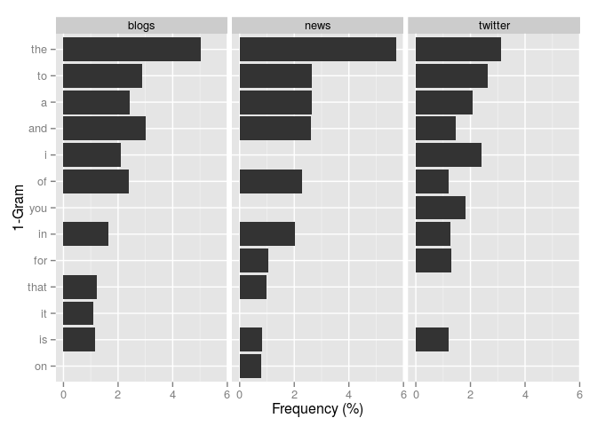
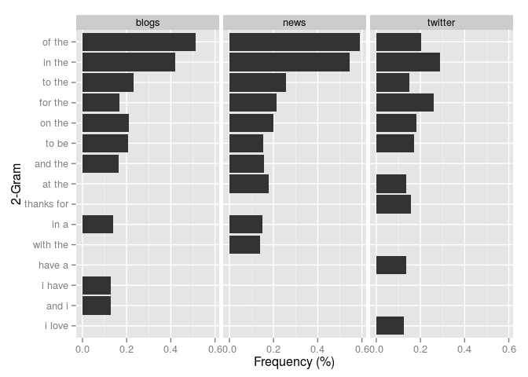
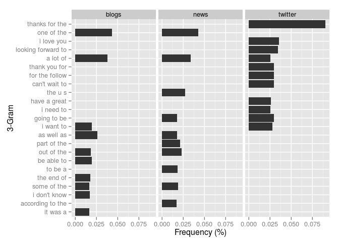

# Milestone Report

## Introduction

This report presents an exploratory data analysis of the English documents
that will be used to train a model for predicting the next word in a given
sequence of words. The documents are part of a larger corpus  called
[HC Corpora](http://www.corpora.heliohost.org) and were collected from
blogs, news and Twitter.

## Basic Statistics

This section presents some basic statistics about the training documents.

The table below reports the size of the files containing the documents
and the number of lines.

```
Corpus    File Size (mb)   Number of Lines 
--------  ---------------  ----------------
blogs     210.16           899,288         
news      205.81           1,010,242       
twitter   167.11           2,360,148  
```

The following table summarizes the distribution of the number of words
per line in each file.

```
Corpus     Min.   1st Qu.   Median    Mean   3rd Qu.   Max.
--------  -----  --------  -------  ------  --------  -----
blogs         0         9       28   41.75        60   6726
news          1        19       32   34.41        46   1796
twitter       1         7       12   12.75        18     47
```

## N-Gram Frequency

This section illustrates the frequency of 1-grams, 2-grams and 3-grams in the
documents. Each plot presents the 10 most frequent $n$-grams for each
type of document along with their frequencies. The frequencies were
estimated from a random sample with 1% of the lines in each file.

 

 

 

## Conclusions & Outlook

As expected, the documents obtained from news and blogs are longer and have
a larger number of words than the Twitter documents. The analysis also revealed
some characteristics of the language used in the documents. For example, the texts
from blogs and Twitter frequently use personal pronouns -- such as 'I' and 'you' --
while the news documents use a more impersonal language.  The model for predicting
the next word in a sequence of words will be based on tables of $n$-gram
frequencies built from the training documents.
